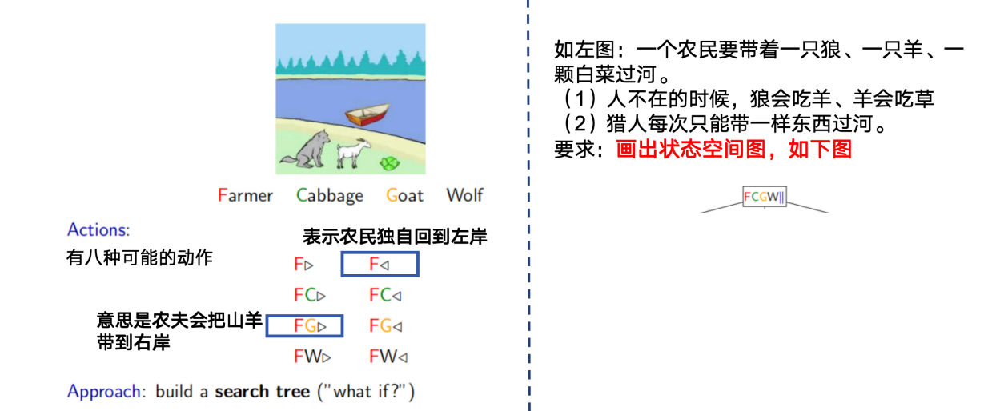
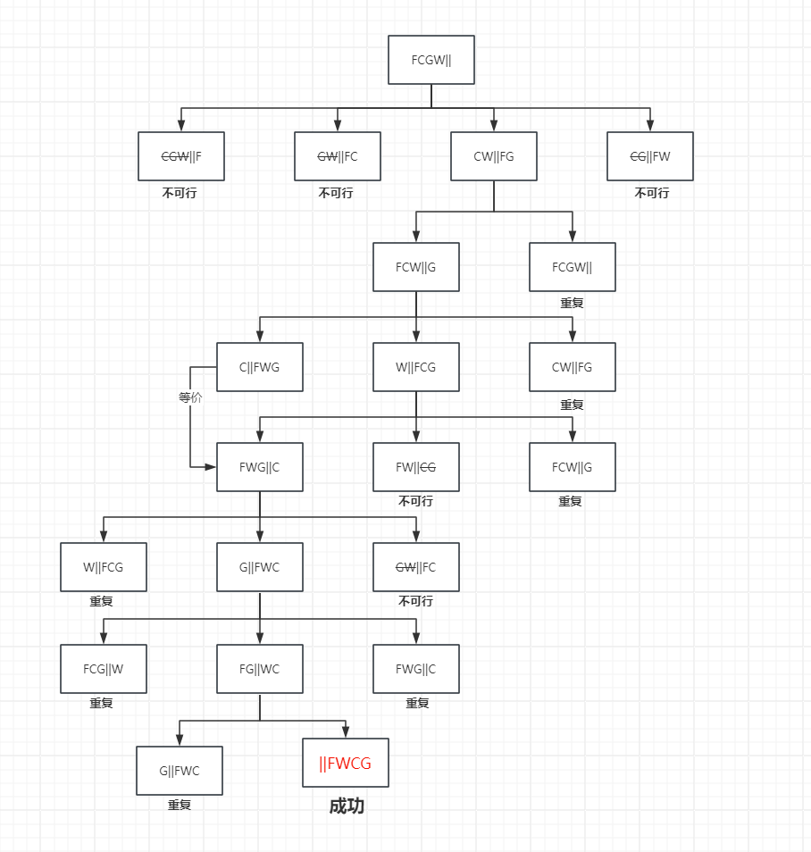
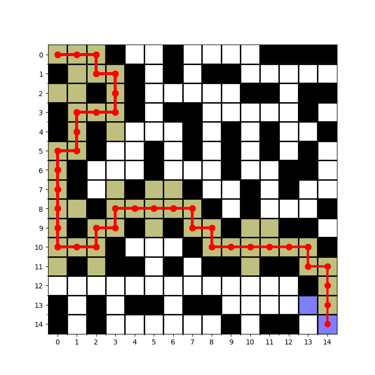
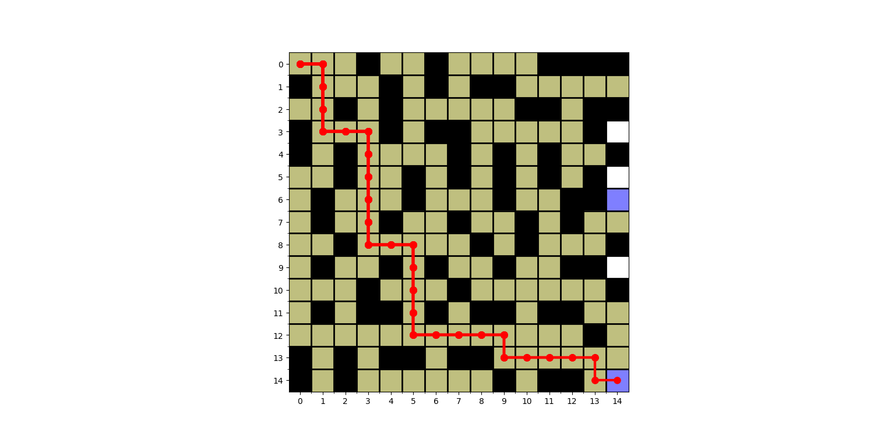
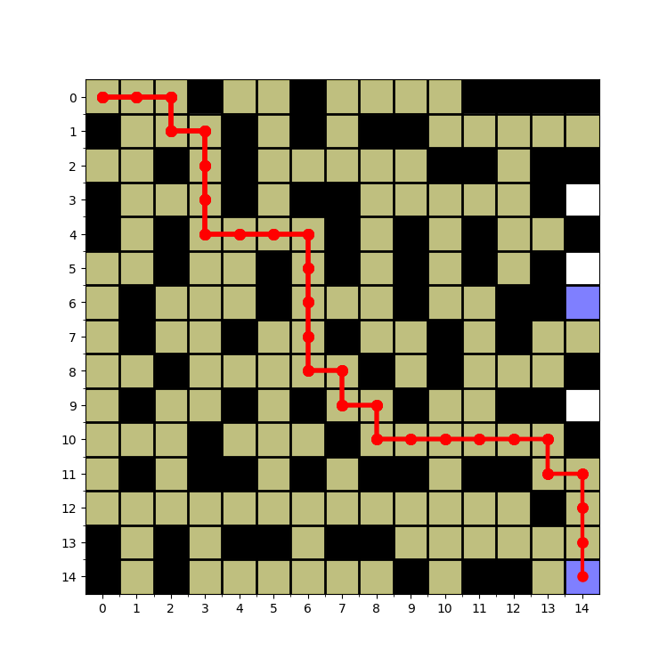
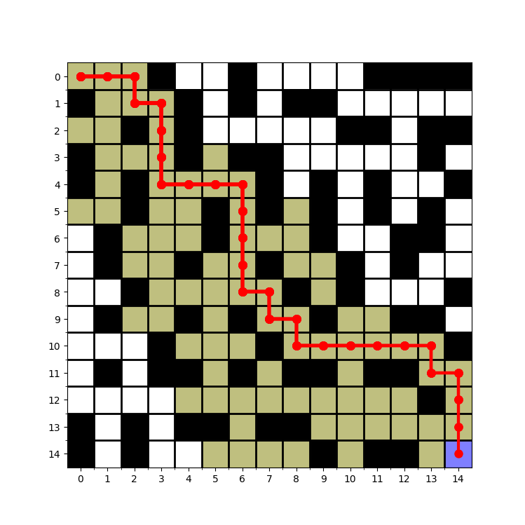
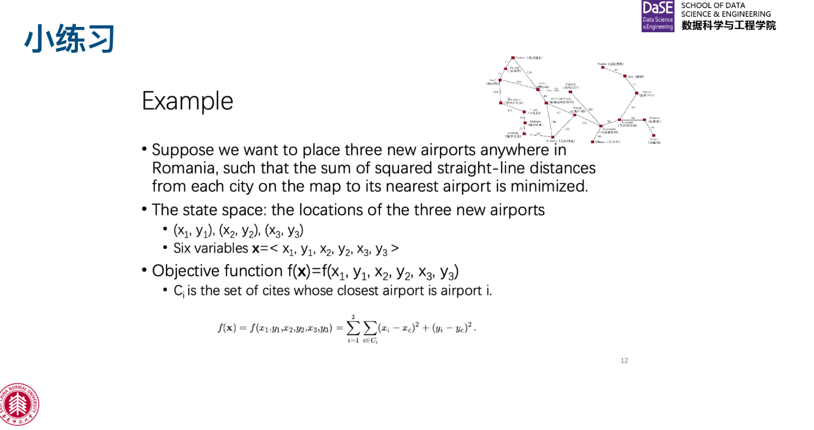
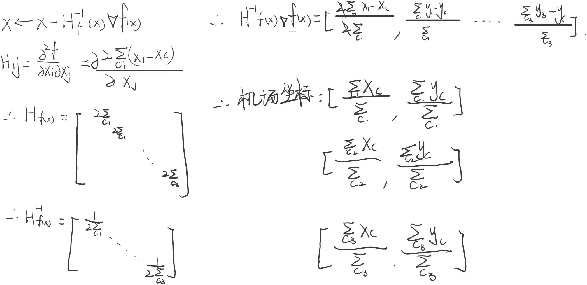

# **Project One**

# **搜索算法**


## 小练习




### 答案如图




## **1.** **算法回顾**

### • 1.1: BFS（每条边的权重为1）

```c++
#include<iostream>
#include<queue>
using namespace std;
vector<int> g[100001];
int visit[100001]={0};
int parent[100001]={0}; 
queue<int> q;

int bfs(int n){
    int startpoint=1,count=0;
    while(!q.empty()){
        startpoint=q.front();
        if(startpoint==n){
            count=0;
            while(startpoint!=1){
                startpoint=parent[startpoint];
                count++;
            }
            return count;
        }
        q.pop();
        visit[startpoint]=1;
        for(auto i:g[startpoint]){
            if(visit[i]==0){
                q.push(i);
                parent[i]=startpoint;
                visit[i]=1;
            }
        }
    }
    return -1;
}

int main(){
    int n=0,m=0,start=0,end=0;
    cin>>n>>m;
    for(int i=0;i<m;i++){
        cin>>start>>end;
        g[start].push_back(end);
    }
    for(int i=0;i<100000;i++){
        visit[i]=0;
        parent[i]=0;
    }
    q.push(1);
    cout<<bfs(n);
}
```

V是顶点数量，E是边数量

时间复杂度：O(E)

空间复杂度：O(V+E）

使用邻接表，会从起始点遍历可达点，遍历的最差情况是要遍历图中所有的边，因此时间复杂度是O(E)。题目需要记录邻接表(大小为E)、队列`q`(大小为V)、访问节点数组`visit`(大小为V)、父节点数组`parent`（大小为V），因此空间复杂度是O(V+E)。


### • 1.2: 朴素版Dijkstra（图最短路）

```c++
#include <iostream>
#include <queue>
using namespace std;
vector<pair<int, int>> g[100001];
int state[100001] = {0};
int dis[100001] = {0};
#define _MAX 9999999

int dijkstra(int n)
{
    int startpoint = 1, t = 0;
    dis[1] = 0;
    for (int i = 0; i < n; i++)
    {
        t = -1;
        for (int j = 1; j <= n; j++)
        {
            if (state[j] == 0)
            {
                if (t == -1 || dis[j] < dis[t])
                {
                    t = j;
                }
            }
        }
        state[t] = 1;
        for (auto i : g[t])
        {
            int tmp1 = i.first;
            int tmp2 = i.second;
            if (state[tmp1] == 0)
            {
                dis[tmp1] = min(tmp2 + dis[t], dis[tmp1]);
            }
        }
    }
    if (dis[n] != _MAX)
        return dis[n];
    else
        return -1;
}

int main()
{
    int n = 0, m = 0, start = 0, end = 0, value = 0;
    cin >> n >> m;
    for (int i = 0; i < m; i++)
    {
        cin >> start >> end >> value;
        g[start].push_back({end, value});
    }
    for (int i = 0; i < 100000; i++)
    {
        state[i] = 0;
        dis[i] = _MAX;
    }
    cout << dijkstra(n);
}
```

V是顶点数量，E是边数量

时间复杂度：O(V+E²)

空间复杂度：O(V+E)

​	使用邻接表，会从起始点依次选择未访问的节点中距离起点最近的节点进行扩展，直到所有可达的顶点都被访问过。在每次扩展时，更新到达附近节点的最短距离。要遍历图中所有的边，并且每次都要寻找距离起点最近的节点，因此时间复杂度是O(E)。

​	题目需要记录邻接表`g`(大小为E、每个元素是一个 pair，表示到达的顶点和边的权重）、记录更新状态的数组`state`(大小为V)、记录到节点距离的数组`dis`(大小为V)，因此空间复杂度是O(V+E)。

### • 1.3: 堆优化版Dijkstra（图最短路）

```c++
#include <iostream>
#include <queue>
using namespace std;

vector<pair<int, int>> g[100001];
int state[100001] = {0};
int dis[100001] = {0};
#define _MAX 99999999
struct node
{
    friend bool operator<(node n1, node n2)
    {
        return n1.dis > n2.dis;
    }
    int dis;
    int number;
};

priority_queue<node> q;

int dijkstra(int n)
{
    dis[1] = 0;
    struct node cur_node;
    cur_node.dis = 0;
    cur_node.number = 1;
    q.push(cur_node);
    while (!q.empty())
    {
        cur_node = q.top();
        q.pop();
        int cur_number = cur_node.number;
        int cur_dis = cur_node.dis;
        if (state[cur_number])
        {
            continue;
        }
        state[cur_number] = 1;
        for (auto i : g[cur_number])
        {
            int tmp1 = i.first;
            int tmp2 = i.second;
            if (state[tmp1] == 0)
            {
                dis[tmp1] = min(tmp2 + dis[cur_number], dis[tmp1]);
                struct node new_node;
                new_node.dis = dis[tmp1];
                new_node.number = tmp1;
                q.push(new_node);
            }
        }
    }
    if (dis[n] != _MAX)
        return dis[n];
    else
        return -1;
}

int main()
{
    int n = 0, m = 0, start = 0, end = 0, value = 0;
    cin >> n >> m;
    for (int i = 0; i < m; i++)
    {
        cin >> start >> end >> value;
        g[start].push_back({end, value});
    }
    for (int i = 0; i < 10000; i++)
    {
        state[i] = 0;
        dis[i] = _MAX;
    }
    cout << dijkstra(n);
}
```

V是顶点数量，E是边数量

时间复杂度：O(VlogV+E)

空间复杂度：O(V+E)

​	使用邻接表，会从起始点依次选择未访问的节点中距离起点最近的顶点进行扩展，直到所有可达的顶点都被访问过。在每次扩展时，更新到达附近节点的最短距离。要遍历图中所有的边，并且每次优先队列都要通过堆（速度为logV）给出距离起点最近的节点，因此时间复杂度是O(VlogV+E)。

​	题目需要记录邻接表`g`(大小为E、每个元素是一个 pair，表示到达的顶点和边的权重）、记录更新状态的数组`state`(大小为V)、记录到节点最小距离的数组`dis`(大小为V)、优先队列`q`（大小为V），因此空间复杂度是O(V+E)。


## **2.** **⼋数码问题**

### • 2.1: DFS（解存在性问题）

```c++
#include <iostream>
#include <queue>
#include <vector>
#include <stack>
#include <set>
using namespace std;

struct node
{
    string cur_s;
    int cur_x = 0;
}; //状态，位置

int dx[4] = {0, -1, 0, 1};
int dy[4] = {-1, 0, 1, 0};
set<string> vis;
stack<node> st;
string target = "12345678x";

int dfs_8digits()
{
    while(!st.empty()) {
        struct node cur_node=st.top();
        st.pop();
        if (cur_node.cur_s == target) {
            return 1;
        }
        int x1 = cur_node.cur_x / 3;
        int y1 = cur_node.cur_x % 3;

        for (int i = 0; i < 4; i++) {
            int x2 = dx[i] + x1, y2 = dy[i] + y1; 
            if (x2 < 0 || y2 < 0 || x2 > 2 || y2 > 2)
                continue;
            string new_s = cur_node.cur_s;
            int new_x = x2 * 3 + y2;
            swap(new_s[cur_node.cur_x], new_s[new_x]);
            struct node new_node;
            new_node.cur_s = new_s;
            new_node.cur_x = new_x;
            if (vis.count(new_s) == 0) {
                vis.insert(new_s);
                st.push(new_node);
            }
        }
    }
    return 0;
}

int main()
{
    string s = "";
    char t;
    int x = 0;
    for (int i=0;i<9;i++)
    {
        cin >> t;
        s += t;
        if (t == 'x')
        {
            x = i;
        }
    }
    vis.insert(s);
    struct node first_node;
    first_node.cur_s = s;
    first_node.cur_x = x;
    st.push(first_node);
    cout<<dfs_8digits();
}
```

​	八数码dfs：由于每步操作产生4个分支，受最大搜索深度d的影响，八数码dfs的时间复杂度为O(4*d)，空间复杂度在未空间优化、剪枝的情况下应该是$9！$

​	使用`stack`用于dfs搜索过程中存储待搜索的节点，如果使用递归会导致调用层数过多报错。每次尝试将空格与周边存在的邻格交换，直到与目标状态一致。会使用`set`记录访问过的状态避免重复搜索。


### • 2.2: BFS（求解最少步数）

```c++
#include <iostream>
#include <queue>
#include <vector>
#include <set>
using namespace std;

struct node
{
    string cur_s;
    int cur_x = 0;
    int count = 0;
}; //状态，位置，层数

int dx[4] = {0, -1, 0, 1};
int dy[4] = {-1, 0, 1, 0};
queue<node> q;
set<string> vis;

string target = "12345678x";

int bfs_8digits()
{
    while (!q.empty())
    {
        struct node cur_node;
        cur_node = q.front();
        if (cur_node.cur_s == target)
        {
            return cur_node.count;
        }
        q.pop();
        int x1 = cur_node.cur_x / 3;
        int y1 = cur_node.cur_x % 3;

        for (int i = 0; i < 4; i++)
        {
            int x2 = dx[i] + x1, y2 = dy[i] + y1;
            if (x2 < 0 || y2 < 0 || x2 > 2 || y2 > 2)
                continue;
            string new_s = cur_node.cur_s;
            int new_x = x2 * 3 + y2;
            int new_count = cur_node.count + 1;
            swap(new_s[cur_node.cur_x], new_s[new_x]);
            if (vis.count(new_s))
            {
                continue;
            }
            else
            {
                vis.insert(new_s);
            }
            struct node new_node;
            new_node.cur_s = new_s;
            new_node.cur_x = new_x;
            new_node.count = new_count;
            q.push(new_node);
        }
    }
    return -1;
}

int main()
{
    string s = "";
    char t;
    int x = 0;
    for (int i=0;i<9;i++)
    {
        cin >> t;
        s += t;
        if (t == 'x')
        {
            x = i;
        }
    }
    vis.insert(s);
    struct node first_node;
    first_node.cur_s = s;
    first_node.cur_x = x;
    q.push(first_node);
    cout<<bfs_8digits();
}
```

​	八数码bfs：由于每步操作产生4个分支，受最大搜索深度d的影响，八数码bfs的时间复杂度为O(4^d)，空间复杂度在未空间优化、剪枝的情况下应该是$9！$

​	使用`queue`用于bfs搜索过程中存储待搜索的状态，通过逐层扩展来找到从初始状态到目标状态的最少步数。每次尝试将空格与周边存在的邻格交换，直到与目标状态一致。会使用`set`记录访问过的状态避免重复搜索。

​	相比于dfs，bfs通常能够更快地找到解，且能够找到最短路径。

### • 2.3: Dijkstra（特殊的A star）

```c++
#include <iostream>
#include <queue>
#include <vector>
#include <set>
using namespace std;

struct node
{
    string cur_s;
    int cur_x = 0;
    int count = 0;
    friend bool operator< (node n1, node n2)
    {
        return n1.count > n2.count;
    }
}; //状态，位置，层数

int dx[4] = {0, -1, 0, 1};
int dy[4] = {-1, 0, 1, 0};
priority_queue<node> q;
set<string> vis;

string target = "12345678x";

int dijkstra_8digits()
{
    while (!q.empty())
    {
        struct node cur_node;
        cur_node = q.top();
        if (cur_node.cur_s == target)
        {
            return cur_node.count;
        }
        q.pop();
        int x1 = cur_node.cur_x / 3;
        int y1 = cur_node.cur_x % 3;

        for (int i = 0; i < 4; i++)
        {
            int x2 = dx[i] + x1, y2 = dy[i] + y1; 
            if (x2 < 0 || y2 < 0 || x2 > 2 || y2 > 2)
                continue;
            string new_s = cur_node.cur_s;
            int new_x = x2 * 3 + y2;
            int new_count = cur_node.count + 1;
            swap(new_s[cur_node.cur_x], new_s[new_x]);
            if (vis.count(new_s))
            {
                continue;
            }
            else
            {
                vis.insert(new_s);
            }
            struct node new_node;
            new_node.cur_s = new_s;
            new_node.cur_x = new_x;
            new_node.count = new_count;
            q.push(new_node);
        }
    }
    return -1;
}

int main()
{
    string s = "";
    char t;
    int x = 0;
    for (int i=0;i<9;i++)
    {
        cin >> t;
        s += t;
        if (t == 'x')
        {
            x = i;
        }
    }
    vis.insert(s);
    struct node first_node;
    first_node.cur_s = s;
    first_node.cur_x = x;
    q.push(first_node);
    cout << dijkstra_8digits();
}
```

​	八数码dijkstra：由于每步操作产生4个分支，最大搜索深度d，`priority_queue`内部需要堆排序，八数码dijkstra的时间复杂度为O(log4d*4^d)，空间复杂度在未空间优化、剪枝的情况下应该是$9！$

​	使用`priority_queue`用于dijkstra搜索过程中存储待搜索的状态，保证每次从队列中取出的节点是当前最小步数的节点，虽然在这里和bfs效果相同，因为每一步代价都是一样的。每次尝试将空格与周边存在的邻格交换，直到与目标状态一致。会使用`set`记录访问过的状态避免重复搜索。

​	由于交换步骤的代价肯定是1，所以效果与bfs一致。


### • 2.4: A star（求解最少步数）

```c++
#include <iostream>
#include <queue>
#include <set>
#include <map>
using namespace std;

struct node
{
    string cur_s;
    int cur_x = 0;
    int count = 0;
    int fn = 0;
    string path;
    friend bool operator<(node n1, node n2)
    {
        return n1.fn > n2.fn;
    }
}; //状态，位置，层数
int dx[4] = {0, -1, 0, 1};
int dy[4] = {-1, 0, 1, 0};
char step[4] = {'l', 'u', 'r', 'd'};
priority_queue<node> q;
map<string,int> vis;

string target = "12345678x";

bool answer_available(string s)
{
    int cnt = 0;

    for (int i = 0; i < 9; i++)
    {
        for (int j = i + 1; j < 9; j++)
        {
            if (s[i] == 'x' || s[j] == 'x')
            {
                continue;
            }
            if (s[i] > s[j])
            {
                cnt++;
            }
        }
    }
    return cnt % 2;
}

int f(struct node cur_node)
{
    int h = 0;
    int x1 = cur_node.cur_x / 3;
    int y1 = cur_node.cur_x % 3;
    for (int i = 0; i < 9; i++)
    {
        if (i == cur_node.cur_x)
        {
           continue;
        }
        else
        {
            h += abs(i / 3 - (cur_node.cur_s[i] - '1') / 3) + abs(i % 3 - (cur_node.cur_s[i] - '1') % 3);
        }
    }
    return h + cur_node.count;
};

string A_8digits()
{
    while (!q.empty())
    {
        struct node cur_node;
        cur_node = q.top();
        if (cur_node.cur_s == target)
        {
            return cur_node.path;
        }
        q.pop();
        if(vis[cur_node.cur_s]<cur_node.count){continue;}
        int x1 = cur_node.cur_x / 3;
        int y1 = cur_node.cur_x % 3;

        for (int i = 0; i < 4; i++)
        {
            int x2 = dx[i] + x1, y2 = dy[i] + y1; 
            if (x2 < 0 || y2 < 0 || x2 > 2 || y2 > 2)
                continue;
            string new_s = cur_node.cur_s;
            int new_x = x2 * 3 + y2;
            int new_count = cur_node.count + 1;
            string new_path = cur_node.path + step[i];
            swap(new_s[cur_node.cur_x], new_s[new_x]);
            if (vis.count(new_s)&&vis[new_s]<=new_count)
            {
                continue;
            }
            else
            {
                vis[new_s]=new_count;
            }
            struct node new_node;
            new_node.cur_s = new_s;
            new_node.cur_x = new_x;
            new_node.count = new_count;
            new_node.fn = f(new_node);
            new_node.path = new_path;
            q.push(new_node);
        }
    }
    return "unsolvable";
}

int main()
{
    string s = "";
    char t;
    int x = 0;
    for (int i = 0; i < 9; i++)
    {
        cin >> t;
        s += t;
        if (t == 'x')
        {
            x = i;
        }
    }
    vis[s]=0;
    struct node first_node;
    first_node.cur_s = s;
    first_node.cur_x = x;
    f(first_node);
    q.push(first_node);
    if (answer_available(s))
    {
        cout << "unsolvable";
    }
    else
    {
        cout << A_8digits();
    }
}
```

​	八数码`A*`：由于每步操作产生4个分支，最大搜索深度d，`priority_queue`内部需要堆排序，八数码`A*`的时间复杂度为O(log4d*4^d)，空间复杂度在未空间优化、剪枝的情况下应该是$9！$

​	同样使用`priority_queue`保证了每个处理的节点都是当前步数和估计剩余步数之和最小的节点。每次尝试将空格与周边存在的邻格交换，直到与目标状态一致。会使用`map`记录访问过的节点以及对应的`fn`，如果访问过的节点的`fn`更新后会比`map`记录中的小，那么就会修改`map`并将节点修改为新状态加入`priority_queue`。函数`f`是评价函数$f(n)=g(n)+h(n)$，$h(n)$的计算方法在这里是计算1~8到正确位置的曼哈顿距离。

​	`A*`算法的主要精髓在评价函数$f(n)=g(n)+h(n)$。相比于Dijkstra算法，A*算法在评价函数下能够更快地找到最短路径。当$h(n)=0$ 时算法变为Dijkstra；当$h(n)=0$ 并且边权为1时变为 bfs。


## **3.** **迷宫问题**

### • 3.1: DFS

```python
import matplotlib.pyplot as plt

directions = [(1, 0), (0, -1), (-1, 0), (0, 1)]


def dfs(maze, n, m):
    visited = set()
    visited.add((0, 0))
    memory = [(0, 0, 0)]
    stack = [(0, 0, 0)]  # (row, col, steps)
    parents = [[None] * m for _ in range(n)]
    path = []
    global_step = 0
    while stack:
        row, col, steps = stack.pop()
        global_step+=1
        if (row, col) == (n - 1, m - 1):
            path.append((row, col, steps))
            while steps and not (row==0 and col == 0):
                row, col ,steps= parents[row][col]
                path.append((row, col, steps))
            path.reverse()
            return path, memory
        for dr, dc in directions:
            new_row, new_col = row + dr, col + dc
            if 0 <= new_row < n and 0 <= new_col < m and maze[new_row][new_col] == 0 and (new_row, new_col) not in visited:
                visited.add((new_row, new_col))
                memory.append((new_row, new_col, global_step))
                stack.append((new_row, new_col, global_step))
                parents[new_row][new_col] = (row, col, steps)


def visualize_maze_with_path(maze, path, interval, memory):
    if path:
        path_x, path_y, steps = zip(*path)
        plt.figure(figsize=(len(maze[0])/2, len(maze)/2))
        plt.imshow(maze, cmap='Greys', interpolation='nearest') 

        new_colored_cells = []

        k=0
        for i in range(steps[-1]+1):
            if(i==steps[k]):
                plt.plot(path_y[:k + 1], path_x[:k + 1], marker='o',
                        markersize=8, color='red', linewidth=3)
                k+=1
            for x, y in new_colored_cells:
                color = 'yellow'
                plt.fill_between([y - 0.5, y + 0.5], x - 0.5,
                                 x + 0.5, color=color, alpha=0.5)

            new_colored_cells.clear()

            for x, y, step in memory:
                if step == i: 
                    color = 'blue'
                    new_colored_cells.append((x, y))
                    plt.fill_between([y - 0.5, y + 0.5], x - 0.5,
                                     x + 0.5, color=color, alpha=0.5)

            plt.xticks(range(len(maze[0])))
            plt.yticks(range(len(maze)))
            plt.gca().set_xticks(
                [x - 0.5 for x in range(1, len(maze[0]))], minor=True)
            plt.gca().set_yticks(
                [y - 0.5 for y in range(1, len(maze))], minor=True)
            plt.grid(which="minor", color="black", linestyle='-', linewidth=2)
            plt.axis('on')
            plt.pause(interval)
        plt.show()


interval = 0.25

n, m = map(int, input().split())
maze = []
for _ in range(n):
    row = list(map(int, input().split()))
    maze.append(row)

path, memory = dfs(maze, n, m)
visualize_maze_with_path(maze, path, interval, memory)
```

​	dfs函数用于进行搜索，使用栈`stack`来存储当前的位置以及路径的步数，每次探索时，会通过二维列表`parents` 记录父节点方便回溯，最后得到路径列表`path`和搜索过程中的内存列表`memory`，其中`path`和`memory`的元素都由三元组组成，包含 (row, col, steps)，方便在可视化时按步数动态展示。

​	此处`dfs` 函数的时间复杂度和空间复杂度均为 $O(N)$，其中 $N$ 是迷宫中的格子数。

​	可视化部分：记录搜索格子的顺序，以搜索次序迭代展示，黄色是已经搜索过的格子，蓝色是最近一次搜索的格子。


照理来说这是一张gif，但是pdf无法展示，可以点开看[AI/2024.3.8/animation/dfs.gif at main · 18702193515/AI (github.com)](https://github.com/18702193515/AI/blob/main/2024.3.8/animation/dfs.gif)。**==辛苦做的，务必看看！！！==**

以下为最终效果



### • 3.2: BFS

```python
import matplotlib.pyplot as plt

directions = [(1, 0), (-1, 0), (0, 1), (0, -1)]

def bfs(maze, n, m):
    visited = set()
    visited.add((0, 0))
    memory = [(0, 0, 0)]
    queue = [(0, 0, 0)]  # (row, col, steps)
    parents = [[None] * m for _ in range(n)]
    path = []
    while queue:
        row, col, steps = queue.pop(0)
        if (row, col) == (n - 1, m - 1):
            path.append((row, col, steps))
            print(steps)
            while steps:
                steps -= 1
                row, col = parents[row][col]
                path.append((row, col, steps))
            path.reverse()
            return path, memory
        for dr, dc in directions:
            new_row, new_col = row + dr, col + dc
            if 0 <= new_row < n and 0 <= new_col < m and maze[new_row][new_col] == 0 and (new_row, new_col) not in visited:
                visited.add((new_row, new_col))
                memory.append((new_row, new_col, steps + 1))
                queue.append((new_row, new_col, steps + 1))
                parents[new_row][new_col] = (row, col)


def visualize_maze_with_path(maze, path, interval, memory):
    if path:
        path_x, path_y, steps = zip(*path)
        plt.figure(figsize=(len(maze[0])/2, len(maze)/2))
        plt.imshow(maze, cmap='Greys', interpolation='nearest')

        new_colored_cells = []

        for i in range(len(path)):
            plt.plot(path_y[:i + 1], path_x[:i + 1], marker='o',
                     markersize=8, color='red', linewidth=3)

            for x, y in new_colored_cells:
                color = 'yellow'
                plt.fill_between([y - 0.5, y + 0.5], x - 0.5,
                                 x + 0.5, color=color, alpha=0.5)

            new_colored_cells.clear()

            for x, y, step in memory:
                if step == i: 
                    color = 'blue'
                    new_colored_cells.append((x, y))
                    plt.fill_between([y - 0.5, y + 0.5], x - 0.5,
                                     x + 0.5, color=color, alpha=0.5)

            plt.xticks(range(len(maze[0])))
            plt.yticks(range(len(maze)))
            plt.gca().set_xticks(
                [x - 0.5 for x in range(1, len(maze[0]))], minor=True)
            plt.gca().set_yticks(
                [y - 0.5 for y in range(1, len(maze))], minor=True)
            plt.grid(which="minor", color="black", linestyle='-', linewidth=2)
            plt.axis('on')
            plt.pause(interval)
        plt.show()


interval = 0.25

n, m = map(int, input().split())
maze = []
for _ in range(n):
    row = list(map(int, input().split()))
    maze.append(row)

path, memory = bfs(maze, n, m)
visualize_maze_with_path(maze, path, interval, memory)
```

​	bfs函数用于进行搜索，使用队列`queue`来存储后续要访问的节点。每次探索时，会通过二维列表`parents` 记录父节点方便回溯，最后得到路径列表`path`和搜索过程中的内存列表`memory`，其中`path`和`memory`的元素都由三元组组成，包含 (row, col, steps)，方便在可视化时按步数动态展示。

​	此处`bfs` 函数的时间复杂度和空间复杂度均为 $O(N)$，其中 $N$ 是迷宫中的格子数。

​	可视化部分：记录搜索格子的步数，黄色是已经搜索过的格子，蓝色是最近一次搜索的格子。由于bfs逐层搜索，因此以步数迭代展示，采用类似洪水填充法。


照理来说这是一张gif，但是pdf无法展示，可以点开看[AI/2024.3.8/animation/bfs.gif at main · 18702193515/AI (github.com)](https://github.com/18702193515/AI/blob/main/2024.3.8/animation/bfs.gif)。**==辛苦做的，务必看看！！！==**

以下为最终效果



### • 3.3: Dijkstra

```python
import matplotlib.pyplot as plt
import queue
directions = [(1, 0), (-1, 0), (0, 1), (0, -1)]


def dijkstra(maze, n, m):
    memory = [(0, 0, 0)]
    distances = {(i, j): float('inf') for i in range(n) for j in range(m)}
    distances[(0, 0)] = 0
    pq = queue.PriorityQueue()
    pq.put((0, (0, 0)))
    parents = [[None] * m for _ in range(n)]
    path = []
    while queue:
        steps, (row, col) = pq.get()
        if (row, col) == (n - 1, m - 1):
            path.append((row, col, steps))
            print(steps)
            while steps:
                steps -= 1
                row, col = parents[row][col]
                path.append((row, col, steps))
            path.reverse()
            return path, memory
        for dr, dc in directions:
            new_row, new_col = row + dr, col + dc
            if 0 <= new_row < n and 0 <= new_col < m and maze[new_row][new_col] == 0:
                if steps + 1 < distances[(new_row, new_col)]:
                    distances[(new_row, new_col)] = steps + 1
                    memory.append((new_row, new_col, steps + 1))
                    pq.put((steps + 1, (new_row, new_col)))
                    parents[new_row][new_col] = (row, col)


def visualize_maze_with_path(maze, path, interval, memory):
    if path:
        path_x, path_y, steps = zip(*path)
        plt.figure(figsize=(len(maze[0])/2, len(maze)/2))
        plt.imshow(maze, cmap='Greys', interpolation='nearest') 

        new_colored_cells = []

        for i in range(len(path)):
            plt.plot(path_y[:i + 1], path_x[:i + 1], marker='o',
                     markersize=8, color='red', linewidth=3)

            for x, y in new_colored_cells:
                color = 'yellow'
                plt.fill_between([y - 0.5, y + 0.5], x - 0.5,
                                 x + 0.5, color=color, alpha=0.5)

            new_colored_cells.clear()

            for x, y, step in memory:
                if step == i: 
                    color = 'blue'
                    new_colored_cells.append((x, y))
                    plt.fill_between([y - 0.5, y + 0.5], x - 0.5,
                                     x + 0.5, color=color, alpha=0.5)

            plt.xticks(range(len(maze[0])))
            plt.yticks(range(len(maze)))
            plt.gca().set_xticks(
                [x - 0.5 for x in range(1, len(maze[0]))], minor=True)
            plt.gca().set_yticks(
                [y - 0.5 for y in range(1, len(maze))], minor=True)
            plt.grid(which="minor", color="black", linestyle='-', linewidth=2)
            plt.axis('on')
            plt.pause(interval)
        plt.show()


interval = 0.25

n, m = map(int, input().split())
maze = []
for _ in range(n):
    row = list(map(int, input().split()))
    maze.append(row)

path, memory = dijkstra(maze, n, m)
visualize_maze_with_path(maze, path, interval, memory)

```

​	dijkstra函数用于进行搜索，使用优先队列`pq`来存储后续要访问的节点，并且在内部会以到达的步数step将节点从小到大排序，保证每次弹出的都是距离初始点最短的路径。每次探索时，会通过二维列表`parents` 记录父节点方便回溯，`distances` 字典用于记录起点到各个单元格的最短距离。最后得到路径列表`path`和搜索过程中的内存列表`memory`，其中`path`和`memory`的元素都由三元组组成，包含 (row, col, steps)，方便在可视化时按步数动态展示。

​	此处`dijkstra` 函数的时间复杂度为 $O(NlogN)$，由于边权都是1，优先队列维护堆需要log级的时间开销，并不经济。空间复杂度由于迷宫本身的存在则仍是 $O(N)$其。中 $N$ 是迷宫中的格子数。

​	可视化部分：记录搜索格子的步数，由于dijkstra在边权为1的情况下与bfs等价，因此也是逐层搜索，因此以步数迭代展示，采用类似洪水填充法。


照理来说这是一张gif，但是pdf无法展示，可以点开看[AI/2024.3.8/animation/dijkstra.gif at main · 18702193515/AI (github.com)](https://github.com/18702193515/AI/blob/main/2024.3.8/animation/dijkstra.gif)。**==辛苦做的，务必看看！！！==**

以下为最终效果




### • 3.4: A star

```python
import matplotlib.pyplot as plt
import queue
directions = [(1, 0), (-1, 0), (0, 1), (0, -1)]


def A(maze, n, m):
    visited = set()
    visited.add((0, 0))
    memory = [(0, 0, 0)]
    pq = queue.PriorityQueue()
    pq.put((n + m - 2, (0, 0, 0)))
    parents = [[None] * m for _ in range(n)]
    path = []
    while queue:
        dis, (row, col, steps) = pq.get()
        if (row, col) == (n - 1, m - 1):
            path.append((row, col, steps))
            print(steps)
            while steps:
                steps -= 1
                row, col = parents[row][col]
                path.append((row, col, steps))
            path.reverse()
            return path, memory
        for dr, dc in directions:
            new_row, new_col = row + dr, col + dc
            if 0 <= new_row < n and 0 <= new_col < m and maze[new_row][new_col] == 0 and (new_row, new_col) not in visited:
                visited.add((new_row, new_col))
                new_dist = steps + abs(n - 1 - row) + abs(m - 1 - col)
                memory.append((new_row, new_col, steps + 1))
                pq.put((new_dist, (new_row, new_col, steps + 1)))
                parents[new_row][new_col] = (row, col)


def visualize_maze_with_path(maze, path, interval, memory):
    if path:
        path_x, path_y, steps = zip(*path)
        plt.figure(figsize=(len(maze[0])/2, len(maze)/2))  
        plt.imshow(maze, cmap='Greys', interpolation='nearest')  
        new_colored_cells = []

        for i in range(len(path)):
            plt.plot(path_y[:i + 1], path_x[:i + 1], marker='o',
                     markersize=8, color='red', linewidth=3)

            for x, y in new_colored_cells:
                color = 'yellow'
                plt.fill_between([y - 0.5, y + 0.5], x - 0.5,
                                 x + 0.5, color=color, alpha=0.5)

            new_colored_cells.clear()

            for x, y, step in memory:
                if step == i: 
                    color = 'blue'
                    new_colored_cells.append((x, y))
                    plt.fill_between([y - 0.5, y + 0.5], x - 0.5,
                                     x + 0.5, color=color, alpha=0.5)

            plt.xticks(range(len(maze[0])))
            plt.yticks(range(len(maze)))
            plt.gca().set_xticks(
                [x - 0.5 for x in range(1, len(maze[0]))], minor=True)
            plt.gca().set_yticks(
                [y - 0.5 for y in range(1, len(maze))], minor=True)
            plt.grid(which="minor", color="black", linestyle='-', linewidth=2)
            plt.axis('on')
            plt.pause(interval)
        plt.show()


interval = 0.25

n, m = map(int, input().split())
maze = []
for _ in range(n):
    row = list(map(int, input().split()))
    maze.append(row)

path, memory = A(maze, n, m)
visualize_maze_with_path(maze, path, interval, memory)
```

​	A star函数用于进行搜索，使用优先队列`pq`来存储后续要访问的节点，并且在内部会以评价函数$f(n)=g(n)+h(n)$的结果大小将节点从小到大排序，保证每次弹出的都是评价函数$f(n)=g(n)+h(n)$结果最小的节点，评价函数的估计方法是曼哈顿距离。每次探索时，会通过二维列表`parents` 记录父节点方便回溯。最后得到路径列表`path`和搜索过程中的内存列表`memory`，其中`path`和`memory`的元素都由三元组组成，包含 (row, col, steps)，方便在可视化时按步数动态展示。

​	此处`A*` 函数的时间复杂度为 $O(NlogN)$，每次加入新节点，优先队列维护堆需要log级的时间开销。空间复杂度由于迷宫本身的存在则仍是 $O(N)$其。中 $N$ 是迷宫中的格子数。

​	可视化部分：记录搜索格子的步数，由于dijkstra在边权为1的情况下与bfs等价，因此也是逐层搜索，因此以步数迭代展示，采用类似洪水填充法。


照理来说这是一张gif，但是pdf无法展示，可以点开看[AI/2024.3.8/animation/A.gif at main · 18702193515/AI (github.com)](https://github.com/18702193515/AI/blob/main/2024.3.8/animation/A.gif)。**==辛苦做的，务必看看！！！==**

以下为最终效果



## 小练习



### 答案如图

